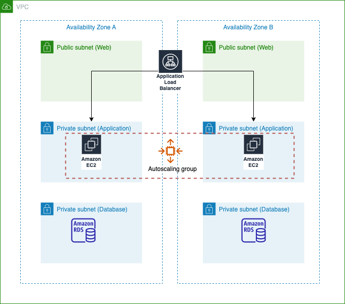

# three-tier-web-application
Three tier web application terraform code

Improvements to be made if I had more time:
* Use variables throughout and use tfvars file to define variable values 
* Use modules (so that code isn’t repeated) 
* Improve naming and tags for resources (follow a naming convention) 
* Store state file externally e.g. S3/DyanmoDB
* Improve code to allow to be easily deploy into multiple environments 

